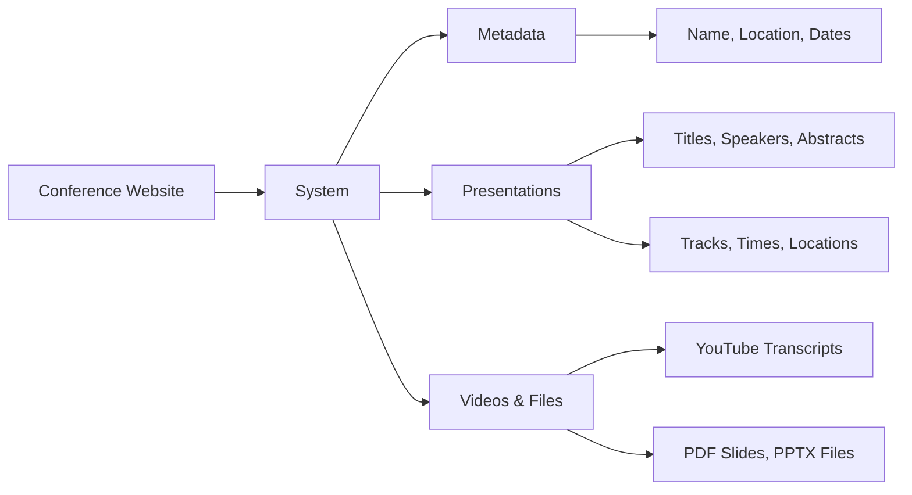
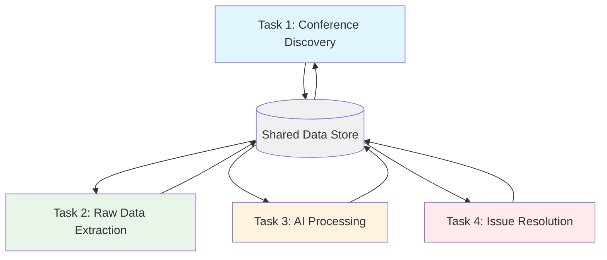

# Conference Data Extraction System

This project systematically extracts and analyzes conference presentation data from CNCF KubeCon conferences. The goal is to create a comprehensive dataset that enables technology trend analysis and intelligent content discovery.

## Why This Exists

Conference presentations contain valuable insights about technology evolution, but this information is scattered across video platforms, slide decks, and conference websites. Manually tracking technology trends across multiple conferences and years is time-consuming and incomplete.

This system automates the extraction process and lays the foundation for intelligent analysis. The immediate goal is creating a structured dataset of conference content. The longer-term vision includes technology trend analysis, emerging tool detection, and personalized content recommendations.

## What This System Does

This repository contains an automated conference data extraction system specifically designed for CNCF KubeCon conferences hosted on Sched.com. Think of it as a sophisticated web scraper with AI-powered analysis capabilities.

### What Gets Extracted

## Current Status

We've completed prototype work that validates the core extraction approach and extensive requirements analysis. The system successfully extracts presentation metadata, transcripts, and files from Sched.com conference websites. Testing on KubeCon 2025 North America demonstrated that the approach works reliably at scale.

The requirements work identified a practical architecture that separates concerns cleanly and positions the project for rapid implementation. The existing requirements are detailed enough that they could be implemented by any developer familiar with web scraping and AI integration. Even a manual implementation following this architecture would provide significant value, with AI components added incrementally as resources allow.
The system is designed as **4 independent tasks** that work together:

The implementation is planned across 10 phases, starting with basic extraction and building toward full AI-powered analysis. Phase 1 focuses on core data extraction with manual conference URL input, while later phases add AI-powered discovery, quality assurance, and advanced analytics. This phased approach ensures the system delivers value early while building toward more sophisticated capabilities.

## Key Design Decisions

The architecture reflects several important design choices that emerged from the requirements analysis.

### Task-Based Architecture
Rather than building a monolithic pipeline, the system separates concerns into 4 independent tasks that communicate through a shared data store. This separation allows data extraction to run independently from AI processing, supports different resource requirements for different tasks, and enables graceful recovery from failures. The task-based approach also means you can implement parts of the system manually while building toward full automation.

### Respectful Extraction
The system is designed to be a good citizen of the web, implementing careful rate limiting and focusing on text content rather than heavy media downloads. This approach proved reliable during testing and ensures the system can operate sustainably without overwhelming conference websites. The extraction process is also fully resumable, so interrupted operations can pick up where they left off without duplicating work.

### AI-Powered Quality Assurance
Quality assurance uses two complementary approaches tailored to different types of work. Extraction QA monitors web scraping using algorithmic checks like file sizes and error logs, while Processing QA uses AI to validate content quality with adaptive confidence scoring. This dual approach balances thoroughness with efficiency, applying the right level of scrutiny to different types of operations.

### Self-Healing Error Handling
The error handling strategy emphasizes automation and context preservation. When problems occur, troubleshooting agents attempt automatic fixes using AI reasoning. If automatic resolution fails, the system creates detailed GitHub issues with full diagnostic context and suspends processing of problematic records. When issues are eventually resolved, processing automatically resumes. This approach minimizes manual intervention while ensuring problems don't get lost or forgotten.

## Future: Analytics and Trend Analysis

The current system focuses on reliable data extraction and basic processing, but the requirements work has identified opportunities for more sophisticated analysis capabilities.

### Technology Trend Analysis
Future phases will add capabilities for detecting emerging technologies before they become mainstream, tracking how technology adoption patterns evolve across conferences, and generating insights by comparing technology focus across different regions and time periods. This analysis builds on the structured dataset created by the extraction system, using AI to identify patterns that would be difficult to spot manually.

### Content Prioritization
Advanced phases will include systems that learn user interests and recommend relevant presentations, focus expensive processing resources on the most valuable content, and help users discover presentations that complement their existing knowledge. The prioritization system will balance processing costs with expected analytical value, ensuring resources are used efficiently.

### Visualization and Reporting
The long-term vision includes dashboards that visualize technology evolution over time, provide predictive analytics about which technologies will become important, and generate summaries for strategic technology investment decisions. These capabilities transform the system from a data extraction tool into a comprehensive analytics platform.

## Getting Started

The system has completed requirements analysis and is ready for implementation. The documentation provides different entry points depending on your interests and role.

For understanding the overall architecture and implementation approach, the main requirements document (`specs/conference-extractor/requirements.md`) provides comprehensive coverage of the 4-task system design. The exploration results (`specs/exploration/`) show the prototype work and validation testing that informed the requirements. Future capabilities are detailed in `specs/future-analytics/requirements.md`, which outlines the analytics and trend analysis vision.

If you want to experiment with the current prototype capabilities, the `scripts/` directory contains working extraction and analysis tools that demonstrate the core concepts.

## Technical Approach

The system uses Python for robust web scraping with comprehensive error handling, integrates multiple search engines (DuckDuckGo, Bing, Google) for reliable conference discovery, and leverages yt_dlp for transcript extraction without API limitations. Data is stored in human-readable YAML format that converts easily to other formats as needs evolve.

The phased implementation approach ensures the system delivers value incrementally while building toward more sophisticated analysis capabilities. This technical foundation, combined with the detailed requirements work, positions the project for rapid development and deployment.

---

*This project transforms conference presentations from scattered, hard-to-discover content into structured, analyzable data that reveals technology trends and accelerates learning in the cloud native ecosystem.*