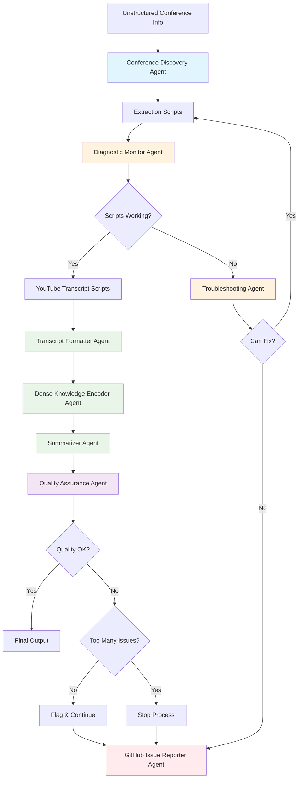
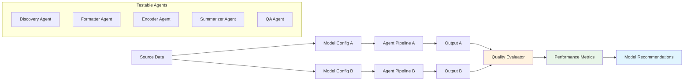
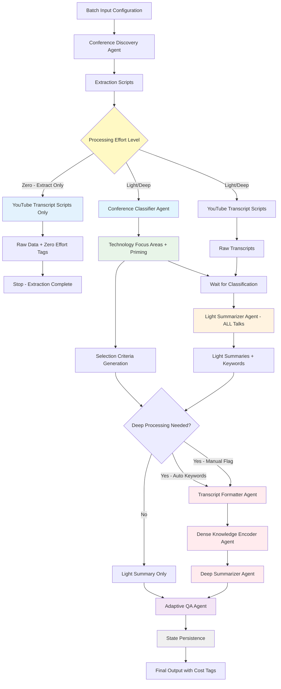
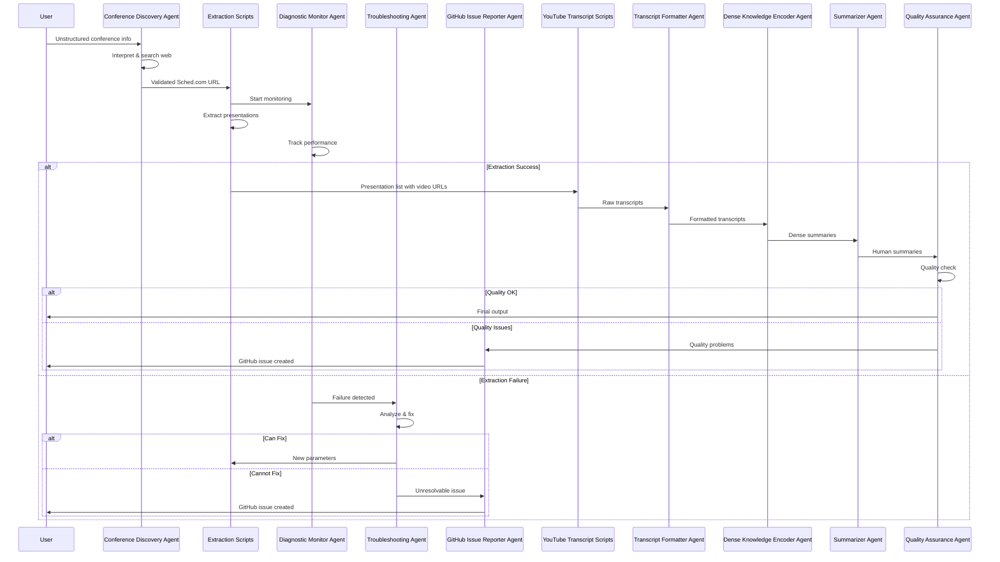
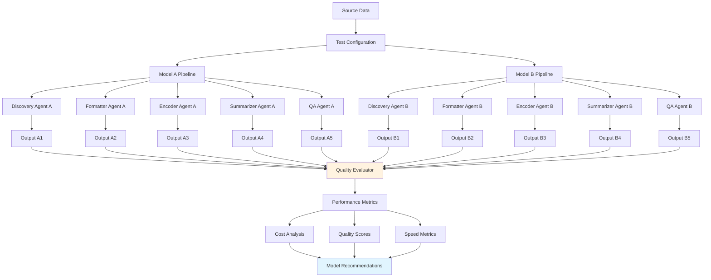
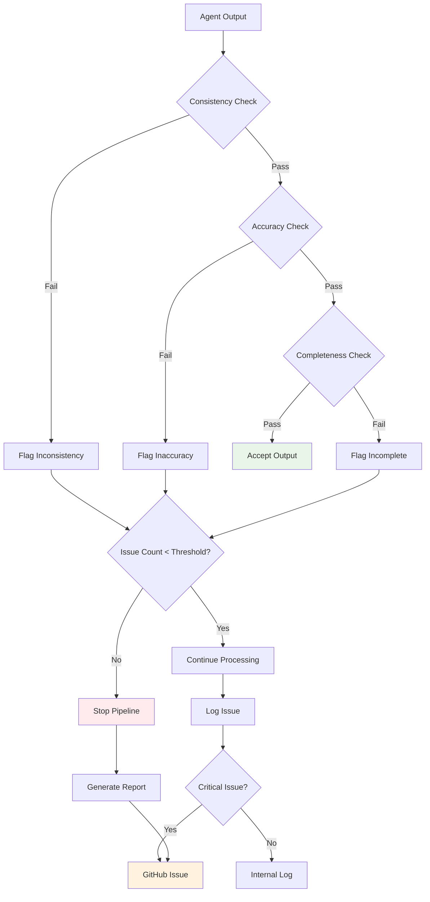

# Requirements Document

## Introduction

This document specifies the requirements for the Agentic Conference Data Extraction System, a sophisticated multi-agent application that automatically discovers, extracts, processes, and analyzes comprehensive presentation data from CNCF KubeCon conferences. The system combines AI agents for complex reasoning tasks with automated scripts for heavy data processing, includes comprehensive quality assurance, and supports A/B testing for model optimization.

## System Architecture Overview

## A/B Testing Framework

## Glossary

- **Conference_Discovery_Agent**: AI agent that interprets unstructured conference information and finds Sched.com URLs
- **Extraction_Scripts**: Automated programs that perform heavy data extraction from Sched.com websites
- **Diagnostic_Monitor_Agent**: AI agent that monitors script performance and detects extraction failures
- **Troubleshooting_Agent**: AI agent that analyzes failures and provides new parameters to fix script issues
- **GitHub_Issue_Reporter_Agent**: AI agent that files detailed bug reports when issues cannot be resolved
- **YouTube_Transcript_Scripts**: Automated programs that extract text transcripts from YouTube videos
- **Transcript_Formatter_Agent**: AI agent that formats raw transcripts with timestamps for human readability
- **Dense_Knowledge_Encoder_Agent**: AI agent that creates compressed summaries for RAG database storage
- **Summarizer_Agent**: AI agent that creates human-readable presentation summaries for decision-making
- **Quality_Assurance_Agent**: AI agent that validates consistency and quality across all agent outputs
- **Model_Configuration_System**: Framework for assigning different AI models to agents for A/B testing
- **Quality_Evaluator**: Component that compares outputs from different models and measures quality differences
- **CNCF**: Cloud Native Computing Foundation, the target conference organization
- **Sched.com**: The conference management platform hosting the target conferences

## Requirements

### Requirement 1

**User Story:** As a conference researcher, I want an AI agent to interpret unstructured conference information and discover the correct Sched.com URL, so that I can start extraction without manual URL hunting.

#### Acceptance Criteria

1. WHEN a user provides unstructured conference information, THE Conference_Discovery_Agent SHALL interpret various formats including partial names, years, and locations
2. WHEN searching for conference URLs, THE Conference_Discovery_Agent SHALL use web search to find Sched.com websites
3. WHEN multiple candidate URLs are found, THE Conference_Discovery_Agent SHALL select the most appropriate main conference page
4. WHEN no suitable URL is found, THE Conference_Discovery_Agent SHALL suggest alternative search strategies and report the failure
5. THE Conference_Discovery_Agent SHALL validate URL accessibility and confirm it contains conference data before proceeding

### Requirement 2

**User Story:** As a system operator, I want automated scripts to handle the heavy data extraction work, so that the system can process large conferences efficiently without constant AI model costs.

#### Acceptance Criteria

1. WHEN provided with a validated conference URL, THE Extraction_Scripts SHALL extract all presentation metadata using the validated patterns from exploration
2. WHEN processing presentation lists, THE Extraction_Scripts SHALL implement rate limiting with configurable delays between requests
3. WHEN extracting individual presentations, THE Extraction_Scripts SHALL gather titles, speakers, dates, tracks, videos, and files
4. WHEN encountering standard parsing errors, THE Extraction_Scripts SHALL retry with exponential backoff
5. THE Extraction_Scripts SHALL generate structured output with extraction statistics and error logs

### Requirement 3

**User Story:** As a reliability engineer, I want a lightweight AI agent to monitor script performance and trigger troubleshooting when needed, so that issues can be identified and resolved without complex metric thresholds.

#### Acceptance Criteria

1. WHEN extraction scripts are running, THE Diagnostic_Monitor_Agent SHALL observe extraction patterns and identify anomalous behavior using AI reasoning
2. WHEN potential issues are detected, THE Diagnostic_Monitor_Agent SHALL make intelligent decisions about whether to trigger troubleshooting
3. WHEN monitoring detects problems, THE Diagnostic_Monitor_Agent SHALL activate the Troubleshooting_Agent with relevant context
4. WHEN scripts are performing normally, THE Diagnostic_Monitor_Agent SHALL operate with minimal resource usage
5. THE Diagnostic_Monitor_Agent SHALL use low-capability models to keep monitoring costs minimal

### Requirement 4

**User Story:** As a system maintainer, I want an AI agent to analyze extraction failures and provide corrective parameters, so that temporary issues can be resolved automatically without human intervention.

#### Acceptance Criteria

1. WHEN the diagnostic monitor reports extraction problems, THE Troubleshooting_Agent SHALL analyze the failure patterns and error logs
2. WHEN CSS selectors are failing, THE Troubleshooting_Agent SHALL attempt to identify alternative selectors from page structure
3. WHEN rate limiting issues are detected, THE Troubleshooting_Agent SHALL recommend adjusted timing parameters
4. WHEN network issues occur, THE Troubleshooting_Agent SHALL suggest retry strategies and timeout adjustments
5. WHEN troubleshooting succeeds, THE Troubleshooting_Agent SHALL provide updated parameters to restart the extraction scripts

### Requirement 5

**User Story:** As a developer, I want automated GitHub issue creation when problems cannot be resolved, so that I receive detailed bug reports with sufficient context to fix issues efficiently.

#### Acceptance Criteria

1. WHEN the troubleshooting agent cannot resolve extraction failures, THE GitHub_Issue_Reporter_Agent SHALL create detailed bug reports
2. WHEN filing issues, THE GitHub_Issue_Reporter_Agent SHALL include error logs, diagnostic information, and reproduction steps
3. WHEN creating bug reports, THE GitHub_Issue_Reporter_Agent SHALL attach relevant HTML samples and configuration details
4. WHEN multiple similar issues exist, THE GitHub_Issue_Reporter_Agent SHALL update existing issues rather than creating duplicates
5. THE GitHub_Issue_Reporter_Agent SHALL categorize issues by severity and assign appropriate labels for triage

### Requirement 6

**User Story:** As a content analyst, I want automated extraction of YouTube transcripts from presentation videos, so that I can analyze the actual content of presentations beyond just metadata.

#### Acceptance Criteria

1. WHEN presentation videos are identified, THE YouTube_Transcript_Scripts SHALL extract available text transcripts using YouTube APIs
2. WHEN transcripts are not available, THE YouTube_Transcript_Scripts SHALL attempt to use automated speech recognition if configured
3. WHEN processing transcripts, THE YouTube_Transcript_Scripts SHALL preserve timing information and speaker identification where available
4. WHEN transcript extraction fails, THE YouTube_Transcript_Scripts SHALL log the failure and continue with remaining videos
5. THE YouTube_Transcript_Scripts SHALL handle rate limiting and API quotas appropriately for batch processing

### Requirement 7

**User Story:** As a content consumer, I want AI-formatted transcripts with proper timestamps and structure, so that I can easily read and reference specific sections of presentations.

#### Acceptance Criteria

1. WHEN raw transcripts are available, THE Transcript_Formatter_Agent SHALL create human-readable formatted versions with proper paragraphing
2. WHEN formatting transcripts, THE Transcript_Formatter_Agent SHALL preserve and enhance timestamp information for major sections
3. WHEN speaker changes are detected, THE Transcript_Formatter_Agent SHALL clearly indicate speaker transitions
4. WHEN technical terms or acronyms appear, THE Transcript_Formatter_Agent SHALL maintain consistent formatting and capitalization
5. THE Transcript_Formatter_Agent SHALL generate both full transcripts and section-based summaries with timestamps

### Requirement 8

**User Story:** As a knowledge engineer, I want dense summaries with extracted keywords optimized for retrieval systems, so that I can build effective RAG databases for selected high-value presentations.

#### Acceptance Criteria

1. WHEN processing selected presentations, THE Dense_Knowledge_Encoder_Agent SHALL create compressed summaries optimized for semantic search
2. WHEN encoding knowledge, THE Dense_Knowledge_Encoder_Agent SHALL extract and preserve key technical concepts, methodologies, and technology keywords
3. WHEN processing presentations, THE Dense_Knowledge_Encoder_Agent SHALL identify and highlight novel contributions and important findings
4. WHEN creating dense summaries, THE Dense_Knowledge_Encoder_Agent SHALL maintain traceability back to original transcript sections with timestamps
5. THE Dense_Knowledge_Encoder_Agent SHALL generate embeddings-friendly text suitable for vector database storage and tag outputs with processing effort indicators

### Requirement 9

**User Story:** As a conference attendee, I want tiered summaries of presentations with cost-effective processing, so that I can quickly decide which talks are worth deeper investigation while managing processing costs.

#### Acceptance Criteria

1. WHEN processing all presentations, THE Light_Summarizer_Agent SHALL create basic summaries using cost-effective models for every presentation
2. WHEN generating light summaries, THE Light_Summarizer_Agent SHALL extract key topics, speaker information, and basic takeaways with keyword identification
3. WHEN processing selected presentations, THE Deep_Summarizer_Agent SHALL create comprehensive summaries with detailed analysis using sophisticated models
4. WHEN creating tiered summaries, THE system SHALL tag each output with effort indicators showing processing cost and model sophistication used
5. THE Summarizer_Agents SHALL generate summaries in markdown format for human readability and support iterative re-processing of presentations from light to deep summaries

### Requirement 10

**User Story:** As a quality manager, I want adaptive quality assurance that builds confidence over time, so that I can ensure consistency while optimizing QA costs as the system proves reliable.

#### Acceptance Criteria

1. WHEN starting with new agents or conferences, THE Quality_Assurance_Agent SHALL perform comprehensive checking with high sampling rates
2. WHEN building confidence in agent performance, THE Quality_Assurance_Agent SHALL gradually reduce checking frequency while maintaining quality standards
3. WHEN quality issues are detected, THE Quality_Assurance_Agent SHALL increase checking rates for affected agents and flag problems with detailed context
4. WHEN confidence scores indicate reliability, THE Quality_Assurance_Agent SHALL optimize checking to focus on high-risk scenarios while reducing overall QA costs
5. THE Quality_Assurance_Agent SHALL maintain configurable confidence scoring that adapts to agent performance, conference complexity, and historical quality patterns

### Requirement 11

**User Story:** As a system optimizer, I want A/B testing capabilities for different AI models, so that I can optimize cost and performance by using the most appropriate model for each task.

#### Acceptance Criteria

1. WHEN configuring the system, THE Model_Configuration_System SHALL allow assignment of different AI models to each agent role
2. WHEN running A/B tests, THE Model_Configuration_System SHALL process the same source data through different model configurations
3. WHEN comparing outputs, THE Quality_Evaluator SHALL measure differences in quality, speed, and cost between model configurations
4. WHEN A/B testing completes, THE Quality_Evaluator SHALL generate recommendations for optimal model assignments
5. THE Model_Configuration_System SHALL support reproducible testing by maintaining version control of model configurations and test data

### Requirement 12

**User Story:** As a performance analyst, I want comprehensive metrics collection across all system components, so that I can optimize the entire pipeline for cost, speed, and quality.

#### Acceptance Criteria

1. WHEN agents and scripts execute, THE system SHALL collect performance metrics including execution time, token usage, and success rates
2. WHEN quality evaluations occur, THE system SHALL track quality scores and improvement trends over time
3. WHEN A/B tests run, THE system SHALL maintain detailed comparison data for model performance analysis
4. WHEN processing completes, THE system SHALL generate comprehensive reports showing cost-benefit analysis of different configurations
5. THE system SHALL provide APIs for external monitoring and alerting systems to track pipeline health

## Optimized Processing Flow

## Detailed Agent Interaction Flow

## A/B Testing Workflow

## Quality Assurance Decision Tree

## Model Configuration Matrix

The system supports different AI models for each agent type, enabling cost and performance optimization:

| Agent Type | Fast/Cheap Model | Balanced Model | Sophisticated Model |
|------------|------------------|----------------|-------------------|
| Conference Discovery | GPT-4o-mini | GPT-4o | GPT-4o |
| Diagnostic Monitor | GPT-4o-mini | GPT-4o-mini | GPT-4o |
| Troubleshooting | GPT-4o-mini | GPT-4o | GPT-4o |
| GitHub Issue Reporter | GPT-4o-mini | GPT-4o-mini | GPT-4o-mini |
| Transcript Formatter | GPT-4o-mini | GPT-4o | Claude-3.5-Sonnet |
| Dense Knowledge Encoder | GPT-4o | GPT-4o | Claude-3.5-Sonnet |
| Summarizer | GPT-4o-mini | GPT-4o | Claude-3.5-Sonnet |
| Quality Assurance | GPT-4o | GPT-4o | Claude-3.5-Sonnet |

## Success Metrics

### Performance Targets
- **Conference Discovery**: 95% success rate for valid conference names
- **Extraction Scripts**: 80-90% presentation extraction success rate
- **Transcript Processing**: 70% transcript availability (limited by YouTube API)
- **Quality Assurance**: <5% false positive rate, <2% false negative rate
- **End-to-End Processing**: Complete conference processing in <2 hours for 500 presentations

### Cost Optimization Targets
- **Model Selection**: Achieve 90% of sophisticated model quality at 50% of the cost through optimal model assignment
- **A/B Testing**: Identify cost savings opportunities of 20-40% while maintaining quality standards
- **Resource Utilization**: Balance AI model costs with script processing efficiency

### Quality Standards
- **Transcript Formatting**: Human readability score >8/10 in user evaluations
- **Dense Summaries**: Semantic similarity >0.85 with original content
- **Human Summaries**: Decision-making utility score >7/10 in user evaluations
- **Overall Pipeline**: <10% quality issues flagged by QA agent

### Requirement 13

**User Story:** As a content strategist, I want automatic identification of conference technology focus areas, so that all processing agents can be primed with relevant domain expertise for better analysis quality.

#### Acceptance Criteria

1. WHEN presentation titles are extracted, THE Conference_Classifier_Agent SHALL analyze the complete set of titles to identify primary technology focus areas
2. WHEN classifying conference scope, THE Conference_Classifier_Agent SHALL generate technology domain tags and expertise areas that inform subsequent agent processing
3. WHEN processing completes, THE Conference_Classifier_Agent SHALL provide selection criteria and keywords for identifying high-priority presentations for deep processing
4. WHEN classification results are available, THE Conference_Classifier_Agent SHALL prime other agents with domain-specific context to improve analysis quality
5. THE Conference_Classifier_Agent SHALL complete analysis before transcript formatting, summarization, or dense encoding begins to ensure consistent domain expertise

### Requirement 14

**User Story:** As a system administrator, I want centralized configuration management for all models and quality parameters, so that I can easily optimize cost and performance without code changes.

#### Acceptance Criteria

1. WHEN configuring the system, THE Configuration_Manager SHALL provide a single configuration file for all AI model assignments across agents
2. WHEN setting quality thresholds, THE Configuration_Manager SHALL allow specification of quality tolerances for each agent type in the central configuration
3. WHEN optimizing costs, THE Configuration_Manager SHALL support cost budgets and model selection constraints that can be easily modified
4. WHEN updating configurations, THE Configuration_Manager SHALL validate configuration changes and provide warnings for potentially problematic settings
5. THE Configuration_Manager SHALL support environment-specific configurations (development, testing, production) with appropriate defaults for each
### Requirement 15

**User Story:** As a batch processor, I want fully automated operation without user interaction, so that the system can run unattended and be integrated into automated workflows.

#### Acceptance Criteria

1. WHEN the system is running, THE Conference_Extractor SHALL operate without requiring any user input or interactive prompts
2. WHEN processing conferences, THE Conference_Extractor SHALL make all decisions automatically based on configuration and learned parameters
3. WHEN selection criteria are needed, THE Conference_Extractor SHALL use keyword matching and configuration-based rules without user intervention
4. WHEN errors occur, THE Conference_Extractor SHALL handle them automatically through the diagnostic and troubleshooting agents without stopping for user input
5. THE Conference_Extractor SHALL provide comprehensive logging and status reporting for monitoring without requiring interactive feedback

### Requirement 16

**User Story:** As a system operator, I want resumable and idempotent processing, so that interrupted jobs can be restarted efficiently without duplicating completed work.

#### Acceptance Criteria

1. WHEN processing is interrupted, THE Conference_Extractor SHALL maintain state information to enable resumption from the last completed presentation
2. WHEN restarted with identical parameters, THE Conference_Extractor SHALL detect previously completed work and skip redundant processing
3. WHEN configuration changes affect processing level or keywords, THE Conference_Extractor SHALL identify which presentations need reprocessing and update only those
4. WHEN manual flags are added or removed, THE Conference_Extractor SHALL process only the presentations affected by the flag changes
5. THE Conference_Extractor SHALL maintain processing metadata that enables intelligent decisions about what work needs to be redone versus what can be reused

### Requirement 17

**User Story:** As a quality optimizer, I want all AI processing to benefit from conference-specific priming, so that even lightweight models perform optimally with domain-appropriate context.

#### Acceptance Criteria

1. WHEN the Conference_Classifier_Agent completes analysis, THE system SHALL generate domain-specific priming prompts for all subsequent AI agents
2. WHEN processing presentations, THE Light_Summarizer_Agent SHALL wait for classification results and use conference-specific priming to improve output quality
3. WHEN priming agents, THE system SHALL provide technology context, common terminology, and domain expertise relevant to the specific conference
4. WHEN using lightweight models, THE system SHALL leverage priming to achieve performance improvements that approach more expensive model capabilities
5. THE system SHALL maintain priming templates that can be customized based on conference classification results and reused for similar conference types
### Requirement 18

**User Story:** As a data pipeline operator, I want the option to perform only raw data extraction without any AI processing, so that I can separate data acquisition from data processing and optimize resource usage across different execution contexts.

#### Acceptance Criteria

1. WHEN configured for extraction-only mode, THE Conference_Extractor SHALL perform conference discovery, basic metadata extraction, and transcript downloading without any AI agent processing
2. WHEN running in extraction-only mode, THE Conference_Extractor SHALL tag all outputs with zero processing effort and skip conference classification, summarization, and quality assurance steps
3. WHEN restarted with higher processing effort levels, THE Conference_Extractor SHALL detect existing raw data and proceed directly to AI processing phases without re-downloading
4. WHEN switching from extraction-only to full processing, THE Conference_Extractor SHALL maintain all previously extracted raw data and begin processing from the classification phase
5. THE Conference_Extractor SHALL support configuration options that allow users to specify processing effort levels from zero (extraction-only) through full AI processing pipeline