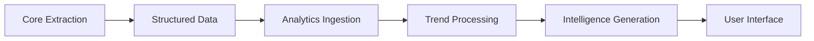

# Future Analytics Implementation Context

> **📋 WHEN TO READ THIS**: Read during future analytics design and implementation phases. Contains detailed context for advanced analytics capabilities.

## Technology Intelligence Architecture

### Data Pipeline for Trend Analysis
- **Temporal data normalization**: Standardize conference dates, technology version references
- **Cross-conference correlation**: Link similar technologies across different conferences and years
- **Semantic clustering**: Group related technologies and practices for trend analysis
- **Evolution tracking**: Monitor technology lifecycle stages across time periods

### Technology Taxonomy Design
```yaml
technology_taxonomy:
  categories:
    - infrastructure: ["Kubernetes", "Docker", "Istio"]
    - observability: ["Prometheus", "Grafana", "Jaeger"]
    - security: ["Falco", "OPA", "Cert-Manager"]
  maturity_levels:
    - experimental: "Early stage, limited adoption"
    - emerging: "Growing adoption, active development"
    - mainstream: "Widely adopted, stable"
    - mature: "Established, incremental improvements"
    - legacy: "Declining usage, maintenance mode"
```

### Quantitative Metrics Framework
- **Adoption indicators**: Company mentions, deployment scales, user counts
- **Performance metrics**: Benchmarks, improvement percentages, efficiency gains
- **Sentiment analysis**: Community perception, problem reports, success stories
- **Trend indicators**: Growth rates, adoption curves, market penetration

## Content Prioritization Intelligence

### Multi-factor Scoring Algorithm
```python
priority_score = (
    speaker_reputation * 0.3 +
    company_influence * 0.2 +
    technology_novelty * 0.25 +
    user_interest_alignment * 0.15 +
    cross_reference_value * 0.1
)
```

### Learning and Adaptation
- **User feedback integration**: Learn from user ratings and engagement
- **Behavioral analysis**: Track which presentations users actually consume
- **Relevance refinement**: Improve scoring based on user preferences over time
- **Context awareness**: Adjust priorities based on user role and current projects

### Dynamic Resource Allocation
- **Cost-benefit optimization**: Balance processing costs with expected value
- **Queue management**: Prioritize high-value content during resource constraints
- **Batch optimization**: Group similar presentations for efficient processing
- **Real-time adjustment**: Modify priorities based on current system load

## Advanced Analytics Capabilities

### Predictive Modeling
- **Technology adoption curves**: Predict mainstream adoption timelines
- **Trend forecasting**: Identify technologies likely to gain traction
- **Risk assessment**: Flag technologies with declining community support
- **Market analysis**: Compare technology adoption across different regions/industries

### Cross-Conference Intelligence
```yaml
conference_comparison:
  technology_focus_evolution:
    kubecon_2023: ["Service Mesh", "GitOps", "Security"]
    kubecon_2024: ["AI/ML Ops", "Platform Engineering", "FinOps"]
    kubecon_2025: ["AI Integration", "Sustainability", "Edge Computing"]
  adoption_patterns:
    early_adopters: ["Startups", "Cloud Native Companies"]
    mainstream_adoption: ["Enterprises", "Financial Services"]
    late_adopters: ["Government", "Healthcare"]
```

### Semantic Search and Retrieval
- **Vector embeddings**: Generate searchable representations of presentation content
- **Similarity matching**: Find related presentations across conferences and years
- **Concept extraction**: Identify abstract concepts and methodologies
- **Knowledge graphs**: Build relationships between technologies, companies, and practices

## User Experience Enhancements

### Personalization Engine
- **Interest profiling**: Build user preference models from interaction data
- **Recommendation system**: Suggest relevant presentations based on past consumption
- **Learning paths**: Create structured learning sequences across multiple presentations
- **Expertise tracking**: Monitor user knowledge growth and adjust recommendations

### Interactive Analytics
- **Query interface**: Natural language queries for trend analysis
- **Visualization tools**: Interactive charts and graphs for trend exploration
- **Drill-down capabilities**: Navigate from high-level trends to specific presentations
- **Export functionality**: Generate reports and datasets for external analysis

### Real-time Intelligence
- **Live trend monitoring**: Track emerging topics as new conferences are processed
- **Alert system**: Notify users of significant trend changes or new developments
- **Comparative analysis**: Real-time comparison of current vs. historical patterns
- **Predictive alerts**: Early warning system for technology shifts

## Data Architecture for Analytics

### Storage Strategy
- **Time-series data**: Optimized storage for temporal trend analysis
- **Graph database**: Relationships between technologies, speakers, companies
- **Vector database**: Semantic search and similarity matching
- **Cache layers**: Fast access to frequently queried trend data

### Data Quality and Validation
- **Consistency checking**: Validate technology mentions across presentations
- **Duplicate detection**: Identify and merge similar technology references
- **Confidence scoring**: Rate reliability of extracted quantitative metrics
- **Human validation**: Sample-based verification of automated extractions

### Privacy and Ethics
- **Data anonymization**: Protect individual speaker and company information
- **Bias detection**: Monitor for algorithmic bias in trend analysis
- **Transparency**: Provide explanations for trend predictions and recommendations
- **User control**: Allow users to control data usage and personalization levels

## Integration with Core System

### Data Flow from Core Pipeline


### Feedback Loops
- **Quality improvement**: Analytics insights improve core extraction quality
- **Prioritization feedback**: User analytics inform content prioritization
- **Model optimization**: Analytics performance guides AI model selection
- **Configuration tuning**: Usage patterns optimize system configuration

### Scalability Considerations
- **Distributed processing**: Handle large-scale analytics across multiple conferences
- **Incremental updates**: Process new data without recomputing entire analytics
- **Resource management**: Balance analytics processing with core extraction needs
- **Performance optimization**: Maintain responsive user experience with large datasets

This context provides the foundation for implementing sophisticated analytics capabilities that transform the conference extraction system into a comprehensive technology intelligence platform.